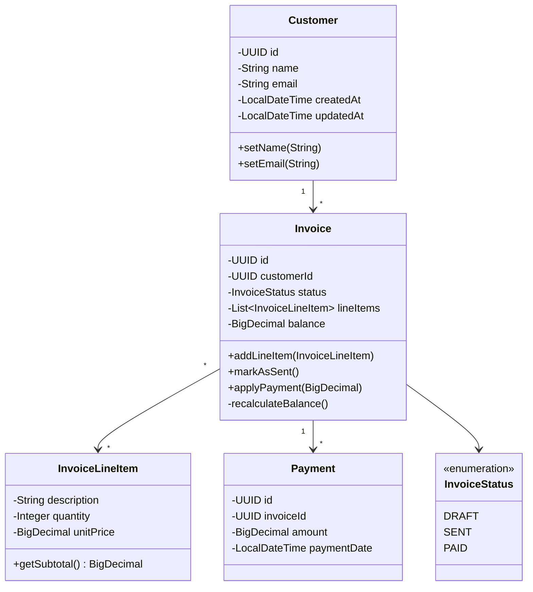
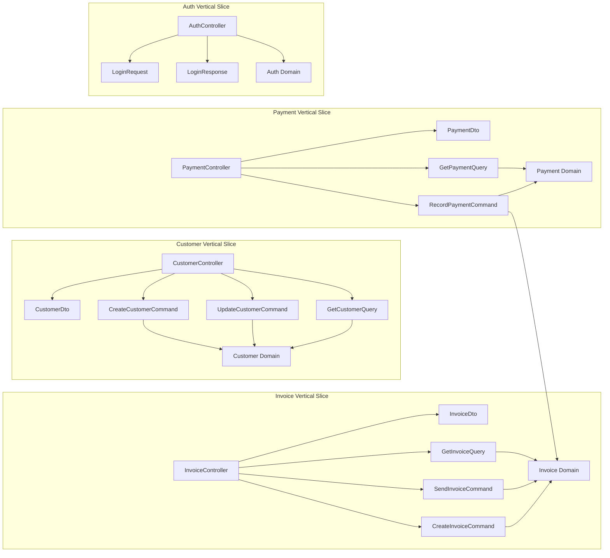
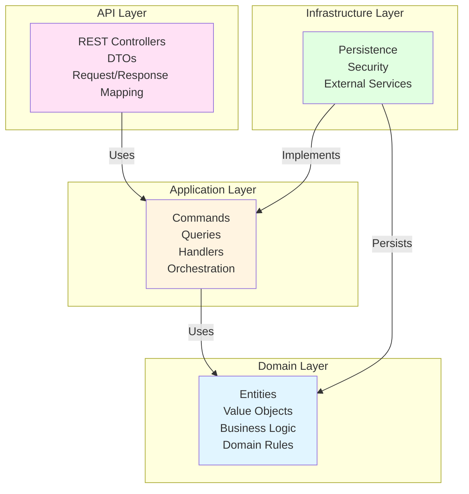
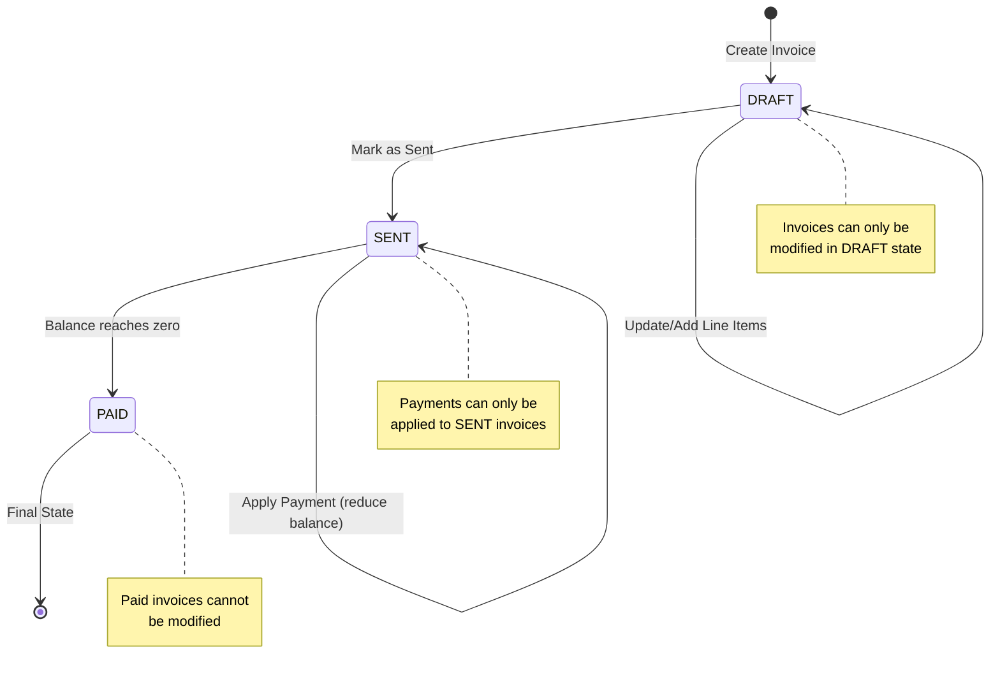

# InvoiceMe - Production-Quality ERP-Style Invoicing System

---

## 📋 Table of Contents

1. [Introduction](#introduction)
2. [Architecture Overview](#architecture-overview)
3. [Business Functionality](#business-functionality)
4. [Technical Requirements](#technical-requirements)
5. [Code Quality and Testing](#code-quality-and-testing)
6. [Getting Started](#getting-started)
7. [Quality Assurance and Verification](#quality-assurance-and-verification)
8. [Project Structure](#project-structure)
9. [Documentation](#documentation)

---

## Introduction

### What is InvoiceMe?

**InvoiceMe** is a production-quality ERP-style invoicing system designed for managing customers, invoices, and payments. Built with modern software architecture principles, InvoiceMe provides a scalable, maintainable solution for businesses that need robust invoicing capabilities.

### Key Features

InvoiceMe enables businesses to:

- **Manage Customers**: Create, update, and maintain customer relationships
- **Handle Invoices**: Create invoices with multiple line items, manage invoice lifecycle (Draft → Sent → Paid), and track balances
- **Process Payments**: Record payments against invoices with automatic balance calculation and state transitions
- **Secure Access**: JWT-based authentication ensures secure access to all business data

### Architecture Highlights

InvoiceMe is built using enterprise-grade architecture patterns:

- **Domain-Driven Design (DDD)**: Rich domain models with encapsulated business logic
- **Command Query Responsibility Segregation (CQRS)**: Clean separation between write and read operations
- **Vertical Slice Architecture (VSA)**: Feature-based organization over technical layers
- **Clean Architecture**: Clear layer separation for maintainability and testability

This architecture ensures the system is scalable, maintainable, and follows industry best practices for production-ready applications.

---

## Architecture Overview

### Domain-Driven Design (DDD)

InvoiceMe implements **Domain-Driven Design** with rich domain entities that encapsulate business logic and enforce business rules.



**Key DDD Principles Demonstrated:**

- **Rich Domain Models**: `Invoice` entity encapsulates business logic (state transitions, balance calculation)
- **Value Objects**: `InvoiceLineItem` represents a value object with calculated subtotal
- **Aggregates**: `Invoice` is an aggregate root managing its line items and state
- **Domain Events**: State transitions are enforced within the domain layer
- **Business Rules**: Invoices can only be modified in `DRAFT` state; payments can only be applied to `SENT` invoices

### Command Query Responsibility Segregation (CQRS)

InvoiceMe implements **CQRS** with clear separation between commands (write operations) and queries (read operations).

```mermaid
graph TB
    subgraph "API Layer"
        AC[CustomerController]
        AI[InvoiceController]
        AP[PaymentController]
    end
    
    subgraph "Application Layer - Commands"
        CC[CreateCustomerCommand]
        UC[UpdateCustomerCommand]
        DC[DeleteCustomerCommand]
        CI[CreateInvoiceCommand]
        UI[UpdateInvoiceCommand]
        SI[SendInvoiceCommand]
        RP[RecordPaymentCommand]
    end
    
    subgraph "Application Layer - Queries"
        GCQ[GetCustomerQuery]
        LCQ[ListCustomersQuery]
        GIQ[GetInvoiceQuery]
        LIQ[ListInvoicesQuery]
        GPQ[GetPaymentQuery]
        LPQ[ListPaymentsQuery]
    end
    
    subgraph "Domain Layer"
        CD[Customer Entity]
        ID[Invoice Entity]
        PD[Payment Entity]
    end
    
    AC -->|POST /customers| CC
    AC -->|PUT /customers/:id| UC
    AC -->|DELETE /customers/:id| DC
    AC -->|GET /customers/:id| GCQ
    AC -->|GET /customers| LCQ
    
    AI -->|POST /invoices| CI
    AI -->|PUT /invoices/:id| UI
    AI -->|POST /invoices/:id/send| SI
    AI -->|GET /invoices/:id| GIQ
    AI -->|GET /invoices| LIQ
    
    AP -->|POST /payments| RP
    AP -->|GET /payments/:id| GPQ
    AP -->|GET /payments| LPQ
    
    CC --> CD
    UC --> CD
    DC --> CD
    CI --> ID
    UI --> ID
    SI --> ID
    RP --> PD
    RP --> ID
    
    GCQ --> CD
    LCQ --> CD
    GIQ --> ID
    LIQ --> ID
    GPQ --> PD
    LPQ --> PD
```



**CQRS Benefits:**

- **Separation of Concerns**: Write operations (commands) are independent from read operations (queries)
- **Independent Optimization**: Read and write paths can be optimized separately
- **Scalability**: Read models can be scaled independently from write models
- **Clear Intent**: Code clearly expresses whether it's modifying state or reading state

### Vertical Slice Architecture (VSA)

InvoiceMe organizes code around **features** (vertical slices) rather than technical layers (horizontal slicing).



**VSA Benefits:**

- **Feature Independence**: Each feature (Customer, Invoice, Payment) is self-contained
- **Reduced Coupling**: Features don't depend on each other's implementation details
- **Easier Maintenance**: Changes to one feature don't affect others
- **Clear Boundaries**: Each slice contains everything needed for that feature (API, DTOs, Commands, Queries, Domain)

### Clean Architecture Layer Separation

InvoiceMe maintains clear boundaries between architectural layers:



**Layer Responsibilities:**

- **API Layer**: REST endpoints, DTOs, request/response mapping
- **Application Layer**: Use cases (commands/queries), orchestration logic
- **Domain Layer**: Pure business logic, no framework dependencies
- **Infrastructure Layer**: Persistence (JPA), security (Spring Security), external services

---

## Business Functionality

### Core Functional Requirements

The system implements the following core operations with clean separation between Commands (mutations) and Queries (reads):

| Domain Entity | Commands (Write Operations) | Queries (Read Operations) |
|--------------|----------------------------|--------------------------|
| **Customer** | Create, Update, Delete Customer | Retrieve Customer by ID, List all Customers |
| **Invoice** | Create (Draft), Update, Mark as Sent, Record Payment | Retrieve Invoice by ID, List Invoices by Status/Customer |
| **Payment** | Record Payment (Applies to Invoice) | Retrieve Payment by ID, List Payments for an Invoice |

### Invoice Lifecycle and Logic

**Line Items**: Each Invoice supports multiple Line Items (describing services/products, quantity, and unit price).

**Lifecycle State Transitions**: The invoice lifecycle follows strict state transitions:



**Balance Calculation**: The system implements robust logic for calculating the running Invoice balance:

- Balance = Sum of (quantity × unit price) for all line items
- When a payment is applied, balance is reduced by payment amount
- When balance reaches zero, invoice automatically transitions to `PAID` state

### User Management

**Authentication**: Basic authentication functionality with a Login screen to secure access to application data.

- JWT-based authentication
- Secure API endpoints
- Session management

---

## Technical Requirements

### Technical Stack

**Back-End (API):**
- **Language**: Java 21
- **Framework**: Spring Boot 3.2.0
- **Build Tool**: Maven (via `mvnw` wrapper)
- **Persistence**: Spring Data JPA with Hibernate
- **Database**: PostgreSQL 16 (production), H2 (testing)
- **Security**: Spring Security with JWT
- **API Documentation**: SpringDoc OpenAPI (Swagger)

**Front-End (UI):**
- **Framework**: Next.js 14.1.0 (App Router)
- **Language**: TypeScript 5.3.3
- **UI Library**: React 18.2.0
- **State Management**: React Context API + Custom Hooks (MVVM pattern)
- **HTTP Client**: Axios 1.6.5
- **Form Handling**: React Hook Form 7.66.0
- **Validation**: Zod 3.22.4
- **Styling**: Tailwind CSS 3.4.18

**Database:**
- **Production**: PostgreSQL 16 (preferred for production readiness)
- **Testing**: H2 in-memory database (for rapid development and testing)

### Performance Benchmarks

- **API Latency**: API response times for standard CRUD operations are under 200ms in local testing environment
- **UI Experience**: Smooth and responsive UI interactions without noticeable lag

Performance tests are included in the test suite to verify these benchmarks.

---

## Code Quality and Testing

### Code Quality Standards

- **Structure**: Code is modular, readable, and well-documented
- **Data Transfer**: Explicit DTOs (Data Transfer Objects) and mappers for boundary crossing (API to Application Layer)
- **Domain Events**: Optional Domain Events demonstrate advanced DDD modeling
- **Consistency**: Consistent naming conventions and clean code organization throughout the repository

### Testing (Mandatory)

**Integration Tests**: Integration tests verify end-to-end functionality across key modules (e.g., the complete Customer → Invoice → Payment flow).

**Test Coverage:**
- **Unit Tests**: Domain entities, business logic
- **Integration Tests**: API endpoints, complete flows
- **E2E Tests**: Complete user journeys (Playwright)
- **Performance Tests**: API latency verification (< 200ms)

---

## Getting Started

### Prerequisites

1. **Java 21 JDK**
   ```bash
   # Check if Java 21 is installed
   java -version
   
   # If not installed, install via Homebrew (macOS)
   brew install openjdk@21
   
   # Set JAVA_HOME (add to ~/.zshrc or ~/.bashrc)
   export JAVA_HOME=/usr/local/opt/openjdk@21
   ```

2. **Node.js 20.11.0+**
   ```bash
   # Check if Node.js is installed
   node -version
   
   # If not installed, use nvm (recommended)
   nvm install 20.11.0
   nvm use 20.11.0
   ```

3. **PostgreSQL** (optional - for dev profile)
   ```bash
   # Install PostgreSQL (macOS)
   brew install postgresql@16
   
   # Start PostgreSQL
   brew services start postgresql@16
   
   # Create database
   createdb invoiceme_dev
   ```

### Installation

```bash
# Clone the repository
git clone <repository-url>
cd invoiceme

# Install frontend dependencies
npm install

# Install Playwright browsers (for E2E tests)
npx playwright install --with-deps
```

### Running the Application

**Option 1: Use Helper Scripts (Recommended)**

```bash
# Start both frontend and backend
./start-servers.sh

# The script will:
# - Start backend on http://localhost:8080
# - Start frontend on http://localhost:3000
# - Wait for both to be ready
```

**Option 2: Manual Start**

```bash
# Terminal 1: Start backend
./start-backend.sh

# Or manually:
./mvnw spring-boot:run -Dspring-boot.run.profiles=dev

# Terminal 2: Start frontend
npm run dev
```

### Test User Setup

Create a test user via API:

```bash
# Create a test user
curl -X POST http://localhost:8080/api/auth/register \
  -H "Content-Type: application/json" \
  -d '{
    "email": "test@example.com",
    "password": "password123"
  }'
```

**Default Test Credentials:**
- **Email:** `test@example.com`
- **Password:** `password123`

---

## Quality Assurance and Verification

InvoiceMe includes comprehensive quality checking tools to verify that all system requirements and architecture patterns are properly implemented.

### Quick Quality Check

**Option 1: Dashboard View (Recommended for Overview)**

```bash
./compliance-dashboard.sh
```

This displays a clean, organized dashboard showing all system features and architecture patterns at a glance with color-coded status indicators.

**Option 2: Detailed Quality Checker**

```bash
./check-compliance.sh
```

This runs comprehensive verification with detailed output for each feature and architecture pattern, including test execution verification.

### What the Quality Scripts Verify

The quality scripts verify:

1. **Project Goal & Architecture**
   - ✅ ERP-style invoicing system
   - ✅ Domain-Driven Design (DDD)
   - ✅ CQRS Pattern (Commands/Queries separation)
   - ✅ Vertical Slice Architecture (VSA)
   - ✅ Clean Architecture layer separation

2. **Business Functionality**
   - ✅ **Customer Domain**: Create, Update, Delete, Retrieve, List
   - ✅ **Invoice Domain**: Create (Draft), Update, Mark as Sent, Retrieve, List
   - ✅ **Payment Domain**: Record Payment, Retrieve, List
   - ✅ **Invoice Lifecycle**: Draft → Sent → Paid transitions
   - ✅ **Line Items**: Multiple line items per invoice
   - ✅ **Balance Calculation**: Running balance and payment application
   - ✅ **Authentication**: Login functionality

3. **Technical Stack**
   - ✅ Backend: Java with Spring Boot
   - ✅ Frontend: TypeScript with Next.js
   - ✅ Database: PostgreSQL (production), H2 (testing)
   - ✅ RESTful APIs
   - ✅ MVVM Frontend Architecture

4. **Code Quality & Testing**
   - ✅ DTOs and Mappers
   - ✅ Integration Tests (Customer → Invoice → Payment flow)
   - ✅ Unit Tests (Domain entities)
   - ✅ E2E Tests (Complete user journey)
   - ✅ Performance Tests (API latency < 200ms)

5. **Documentation**
   - ✅ Product Requirements Document (PRD)
   - ✅ Technical Specification
   - ✅ Requirements Evaluation Report
   - ✅ Code Quality Standards

### Running Tests

**Backend Tests:**

```bash
# Run all backend tests
./mvnw test

# Run specific test class
./mvnw test -Dtest=CustomerInvoicePaymentFlowTest

# Run with coverage report
./mvnw test jacoco:report
# View report: open target/site/jacoco/index.html
```

**Frontend E2E Tests:**

```bash
# Make sure both servers are running first
./start-servers.sh

# Run all E2E tests
npm run test:e2e

# Run tests in UI mode (interactive)
npm run test:e2e:ui

# Run tests in headed mode (see browser)
npm run test:e2e:headed

# View test report
npm run test:e2e:report
```

**Performance Tests:**

```bash
# Run backend performance tests
./mvnw test -Dtest=*PerformanceTest

# Run frontend performance tests
npm run test:performance
```

### Example Compliance Output

When you run `./compliance-dashboard.sh`, you'll see output like:

```
╔═══════════════════════════════════════════════════════════════╗
║                                                               ║
║         InvoiceMe - Requirements Compliance Dashboard        ║
║                                                               ║
╚═══════════════════════════════════════════════════════════════╝

═══════════════════════════════════════════════════════════════
1. PROJECT GOAL & ARCHITECTURE
═══════════════════════════════════════════════════════════════
  ✓ ERP-style invoicing system
  ✓ Domain-Driven Design (DDD)
  ✓ CQRS Pattern (Commands/Queries)
  ✓ Vertical Slice Architecture
  ✓ Clean Architecture Layers

═══════════════════════════════════════════════════════════════
2. BUSINESS FUNCTIONALITY
═══════════════════════════════════════════════════════════════
  Customer Domain:
    ✓ Create, Update, Delete Customer
    ✓ Retrieve Customer by ID, List Customers
  
  Invoice Domain:
    ✓ Create (Draft), Update, Mark as Sent
    ✓ Retrieve Invoice by ID, List Invoices
    ✓ Line Items support
    ✓ Invoice Lifecycle (Draft → Sent → Paid)
    ✓ Balance Calculation
  
  Payment Domain:
    ✓ Record Payment (Applies to Invoice)
    ✓ Retrieve Payment by ID, List Payments
  
  User Management:
    ✓ Authentication (Login)

═══════════════════════════════════════════════════════════════
3. TECHNICAL STACK
═══════════════════════════════════════════════════════════════
  ✓ Backend: Java with Spring Boot
  ✓ Frontend: TypeScript with Next.js
  ✓ Database: PostgreSQL (production)
  ✓ Database: H2 (testing)
  ✓ RESTful APIs
  ✓ MVVM Frontend Architecture

═══════════════════════════════════════════════════════════════
4. CODE QUALITY & TESTING
═══════════════════════════════════════════════════════════════
  ✓ DTOs and Mappers
  ✓ Integration Tests (Customer → Invoice → Payment flow)
  ✓ Unit Tests (Domain entities)
  ✓ E2E Tests (Complete user journey)
  ✓ Performance Tests (API latency < 200ms)

═══════════════════════════════════════════════════════════════
5. DOCUMENTATION
═══════════════════════════════════════════════════════════════
  ✓ Product Requirements Document (PRD)
  ✓ Technical Specification
  ✓ Requirements Evaluation Report
  ✓ Code Quality Standards

═══════════════════════════════════════════════════════════════
SUMMARY
═══════════════════════════════════════════════════════════════

All system requirements have been verified:
  ✓ Modern architecture principles (DDD, CQRS, VSA)
  ✓ Complete business functionality (Customers, Invoices, Payments)
  ✓ Invoice lifecycle with line items and balance calculation
  ✓ Authentication and security
  ✓ Comprehensive testing (Unit, Integration, E2E, Performance)
  ✓ Code quality standards and documentation

✅ InvoiceMe meets all quality and architecture requirements
```

---

## Project Structure

```
invoiceme/
├── app/                          # Next.js App Router (Frontend)
│   ├── (auth)/                   # Auth routes
│   │   └── login/
│   └── (dashboard)/               # Dashboard routes
│       ├── customers/
│       ├── invoices/
│       └── payments/
├── components/                   # React components
│   ├── auth/                     # Auth components
│   ├── forms/                    # Form components
│   └── ui/                       # UI components
├── lib/                          # Utilities and helpers
│   ├── api/                      # API client
│   ├── contexts/                 # React contexts
│   ├── hooks/                    # Custom React hooks (MVVM)
│   └── validation/               # Zod schemas
├── src/                          # Backend (Java/Spring Boot)
│   ├── main/
│   │   ├── java/
│   │   │   └── com/invoiceme/
│   │   │       ├── api/          # API Layer (Vertical Slices)
│   │   │       │   ├── auth/
│   │   │       │   ├── customers/
│   │   │       │   ├── invoices/
│   │   │       │   └── payments/
│   │   │       ├── application/  # Application Layer (CQRS)
│   │   │       │   ├── commands/ # Write operations
│   │   │       │   └── queries/  # Read operations
│   │   │       ├── domain/       # Domain Layer (DDD)
│   │   │       │   ├── customer/
│   │   │       │   ├── invoice/
│   │   │       │   └── payment/
│   │   │       └── infrastructure/ # Infrastructure Layer
│   │   │           ├── persistence/
│   │   │           └── security/
│   │   └── resources/
│   │       ├── application.yml
│   │       ├── application-dev.yml
│   │       └── application-test.yml
│   └── test/                     # Backend tests
│       └── java/
│           └── com/invoiceme/
├── tests/                        # Frontend E2E tests
│   ├── e2e/                      # E2E test specs
│   ├── performance/              # Performance tests
│   └── support/                  # Test utilities
├── docs/                         # Documentation
│   ├── PRD.md                    # Product Requirements Document
│   ├── tech-spec.md              # Technical Specification
│   ├── requirements-evaluation-report.md
│   └── stories/                  # User stories
├── check-compliance.sh           # Detailed compliance checker
├── compliance-dashboard.sh       # Dashboard compliance view
├── start-servers.sh              # Start both servers
├── start-backend.sh              # Start backend only
├── stop-backend.sh               # Stop backend
├── pom.xml                       # Maven configuration
├── package.json                  # Node.js dependencies
└── README.md                     # This file
```

---

## Documentation

### Core Documentation

- **[Product Requirements Document (PRD)](docs/PRD.md)**: Complete product requirements and acceptance criteria
- **[Technical Specification](docs/tech-spec.md)**: Detailed technical design and implementation details
- **[Requirements Evaluation Report](docs/requirements-evaluation-report.md)**: Comprehensive compliance analysis
- **[Code Quality Standards](docs/code-quality-standards-4.1.md)**: Code quality guidelines and standards
- **[Testing Standards](docs/testing-standards-4.2.md)**: Testing guidelines and best practices

### Additional Resources

- **[Local Testing Guide](LOCAL_TESTING.md)**: How to test the application locally
- **[Test Framework Documentation](tests/README.md)**: E2E testing framework documentation
- **[Compliance Checker Documentation](COMPLIANCE-CHECKER.md)**: How to use compliance checking tools

### API Documentation

If SpringDoc OpenAPI is enabled:
- **Swagger UI**: http://localhost:8080/swagger-ui.html
- **OpenAPI JSON**: http://localhost:8080/v3/api-docs

---

## Key Features Demonstrated

### ✅ Domain-Driven Design (DDD)

- Rich domain entities (`Customer`, `Invoice`, `Payment`) with encapsulated business logic
- Value objects (`InvoiceLineItem`) with calculated properties
- Aggregate roots managing their own state and invariants
- Business rules enforced within domain layer

### ✅ Command Query Responsibility Segregation (CQRS)

- Clear separation between commands (write) and queries (read)
- Independent command and query handlers
- Separate optimization paths for reads and writes

### ✅ Vertical Slice Architecture (VSA)

- Feature-based organization (Customer, Invoice, Payment, Auth)
- Each slice contains everything needed for that feature
- Reduced coupling between features
- Clear feature boundaries

### ✅ Clean Architecture

- Clear layer separation (API, Application, Domain, Infrastructure)
- Domain layer has no framework dependencies
- Dependency inversion principles
- Testable architecture

### ✅ Production Quality

- Comprehensive testing (Unit, Integration, E2E, Performance)
- Code quality standards and documentation
- Performance benchmarks met (< 200ms API latency)
- Security (JWT authentication)

---

## License

This project is provided for demonstration purposes.

---

## Contact

For questions or issues, please refer to the documentation or contact the project maintainer.

---


